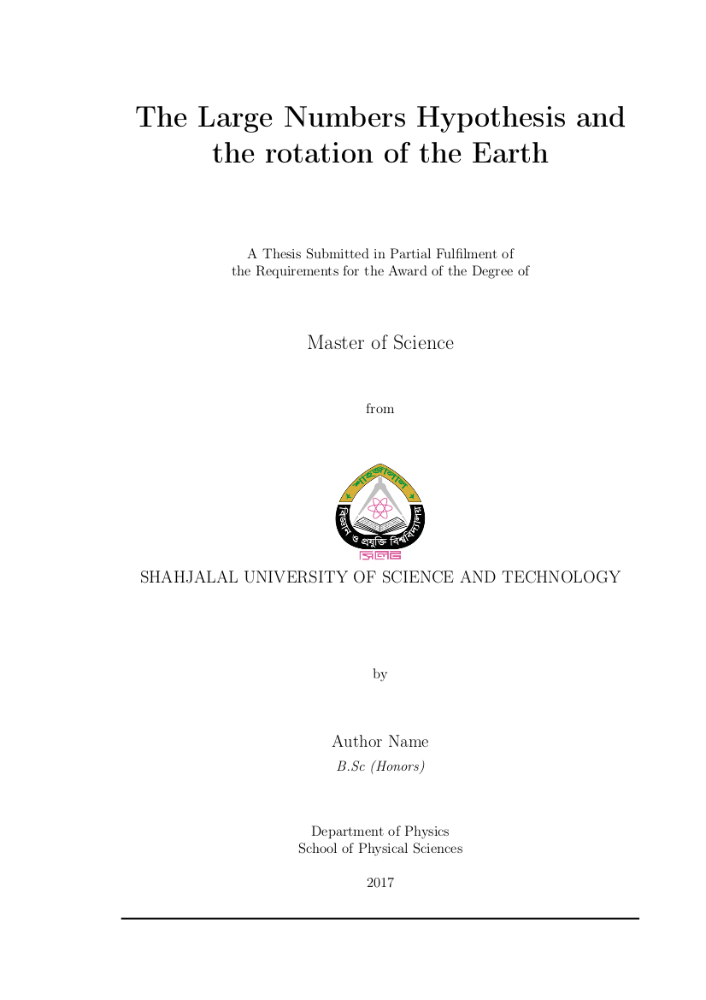

# A **Latex** template for the Masters Thesis 

This template is designed for the student of the *Department of Physics* at Shahjalal University of Science and Technology, Bangladesh.

## How to compile:
To produce main.pdf
$ make

To clean up:
$ make clean

To clean up all:
$ make clean-all

The front page of the template looks like as

All the document class and format are written by **Shakir Ahmed**
(s.ahmed7733@gmail.com)

(c) mjonyh@gmail.com
